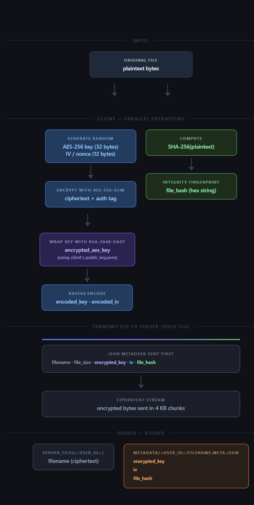
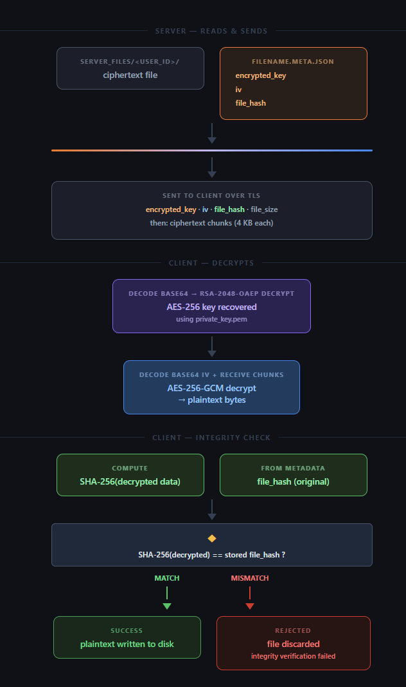
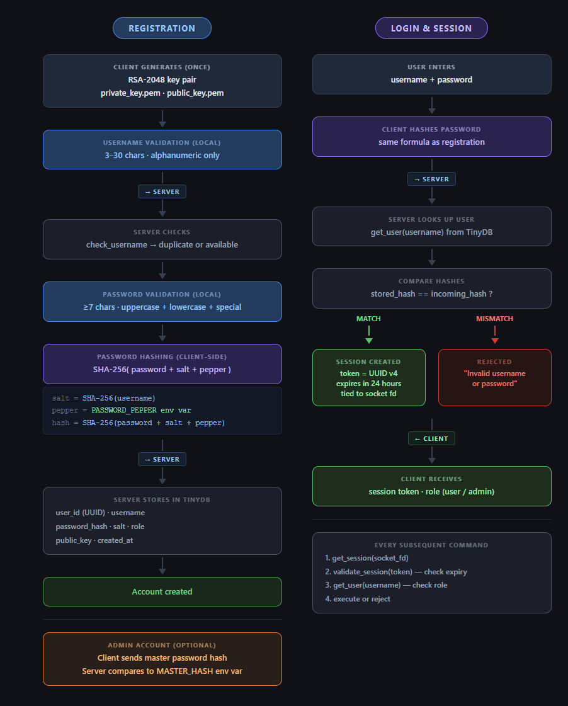
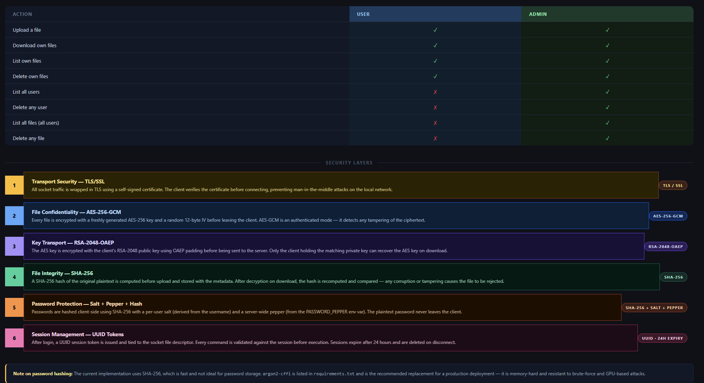

# Secure File Transfer System

A client-server application for encrypted file sharing over a network. Files are protected with AES-256-GCM encryption and RSA-2048 key transport, transmitted over a TLS-secured connection, and verified at the destination using SHA-256 integrity checks.

---

## Features

- **End-to-end encryption** — AES-256-GCM per file, key wrapped with RSA-2048-OAEP
- **Secure transport** — TLS/SSL socket layer using self-signed certificates
- **Integrity verification** — SHA-256 hash checked after every download
- **User authentication** — salted + peppered password hashing, session tokens with 24-hour expiry
- **Role-based access control** — `user` and `admin` roles
- **Admin capabilities** — list/delete any user or file
- **Certificate distribution** — lightweight HTTP server to share the server certificate with clients
- **Progress bars** — real-time upload/download progress via `tqdm`

---

## Architecture

```
.
├── Client/                     # Client application
│   ├── client.py               # Main client — menus, upload, download, auth
│   ├── config.py               # Reads secrets from environment variables
│   ├── key_manager.py          # RSA key pair generation
│   ├── validation.py           # Username / password validation rules
│   └── User/
│       └── user.py             # User data class
│
├── Server/                     # Server application
│   ├── server.py               # Main server — socket, SSL, command dispatch
│   ├── config.py               # Reads secrets from environment variables
│   ├── generate_certificates.py # OpenSSL wrapper to generate self-signed cert
│   ├── Database/
│   │   ├── database_manager.py # TinyDB CRUD — users, files, sessions
│   │   └── shared_constants.py # Network + crypto + DB constants
│   ├── public_cert_server/
│   │   ├── local_server.py     # HTTP server to distribute certificate.pem
│   │   └── server.html         # Download page
│   └── server_files/           # Encrypted file storage (git-ignored)
│
├── .env.example                # Environment variable template
├── requirements.txt
└── DEPLOYMENT.md               # Notes for deploying on a real network
```

---

## How It Works

### System Overview
Every connection is wrapped in TLS. The client connects on port 9999, completes a TLS handshake using the server's self-signed certificate, then registers or logs in before performing any file operations.


### File Upload — Encryption Flow
The client generates a fresh AES-256 key and IV per file, encrypts the file with AES-256-GCM, wraps the AES key with RSA-2048-OAEP using the client's own public key, and streams the ciphertext to the server in 4 KB chunks. The encrypted key, IV, and a SHA-256 hash of the original plaintext are stored as metadata alongside the ciphertext.



### File Download — Decryption Flow
The server sends the ciphertext and its metadata. The client decrypts the AES key using its RSA private key, decrypts the file with AES-256-GCM, then recomputes the SHA-256 hash and compares it to the stored value. A mismatch rejects the file.



### Authentication — Register & Login
On registration the client generates an RSA key pair, validates the username/password locally, hashes the password as `SHA-256(password + salt + pepper)`, and sends the hash and public key to the server. On login the server verifies the hash and issues a UUID session token with a 24-hour expiry. Admin accounts require an additional master password challenge.



### Role-Based Access Control & Security Layers
Two roles are supported — `user` and `admin`. All commands are validated against the active session and the user's role before execution.



---

## Requirements

- Python 3.10+
- OpenSSL (must be available on `PATH`)

Install Python dependencies:

```bash
pip install -r requirements.txt
```

---

## Setup & Running

### 1 — Generate SSL certificates (server side)

```bash
cd Server
python generate_certificates.py
```

This creates `certificate.pem` and `private_key.key` in `Server/`, and copies `certificate.pem` into `Server/public_cert_server/`.

### 2 — Configure secrets

Copy the example environment file and fill in your own values:

```bash
cp .env.example .env
```

Edit `.env`:

```
MASTER_HASH=<sha256 hex of your chosen master password>
PASSWORD_PEPPER=<random secret string>
```

Generate a master hash:

```bash
python -c "import hashlib; print(hashlib.sha256(b'your_password_here').hexdigest())"
```

Both `Server` and `Client` read their respective secrets from environment variables at startup (falling back to demo defaults if unset).

### 3 — Start the certificate distribution server

In a separate terminal:

```bash
cd Server/public_cert_server
python local_server.py
```

Visit `http://localhost:8000/server.html` in a browser and download `certificate.pem` into the `Client/` directory.

### 4 — Start the server

```bash
cd Server
python server.py
```

### 5 — Run the client

```bash
cd Client
python client.py
```

Follow the prompts to register or log in.

---

## Security Notes

| Layer | Mechanism |
|-------|-----------|
| Transport | TLS with self-signed certificate |
| File confidentiality | AES-256-GCM (authenticated encryption) |
| Key transport | RSA-2048-OAEP |
| File integrity | SHA-256 hash compared post-decryption |
| Password storage | SHA-256 + per-user salt + server-side pepper |
| Sessions | UUID token, 24-hour expiry |
| Admin auth | Master password verified via stored hash |

> **Note on password hashing:** The current implementation uses SHA-256, which is fast by design and not ideal for password storage. `argon2-cffi` is included in the dependencies and would be the correct replacement for a production system.

---

## Deployment on a Real Network

See [DEPLOYMENT.md](DEPLOYMENT.md) for instructions on changing the certificate SAN, server hostname, and IP address when moving off localhost.
